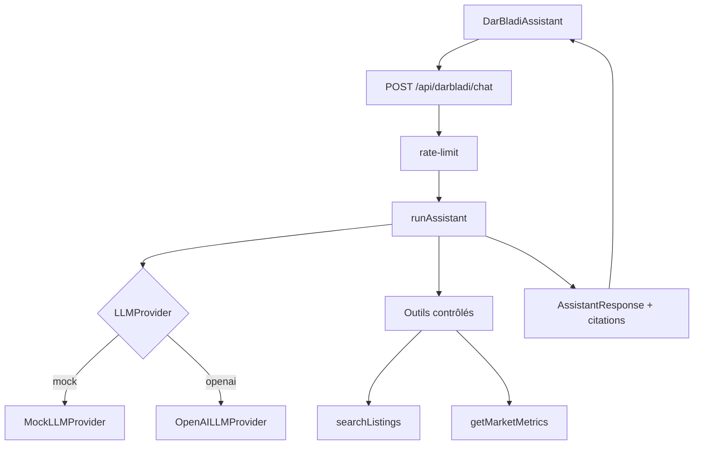

# DarBladi — Architecture intelligence artificielle

## Objectif

Permettre la recherche immobilière en langage naturel via **DarBladi**, l'assistant conversationnel, avec contrôle, transparence et conformité.

## État v0.3.0

| Composant | Statut |
|-----------|--------|
| Parseur local (regex + alias) | ✅ |
| `LLMProvider` Mock + OpenAI | ✅ |
| `assistant-service.ts` | ✅ |
| Outils contrôlés | ✅ |
| API `/api/darbladi/chat` | ✅ |
| UI `DarBladiAssistant` | ✅ |
| Rate limiting | ✅ |
| pgvector + RAG | 📋 Phase 3.1 |

## Diagramme



## Outils contrôlés

| Outil | Description |
|-------|-------------|
| `searchListings` | Recherche catalogue avec filtres validés |
| `getListing` | Détail annonce par ID |
| `compareListings` | Comparaison 2 biens + scores |
| `calculateInvestment` | Calcul rendement déterministe |
| `getMarketMetrics` | Métriques sectorielles démo |

Le LLM **ne construit jamais de SQL** — il délègue aux outils typés.

## Activation OpenAI

```env
AI_PROVIDER=openai
OPENAI_API_KEY=sk-...
AI_RATE_LIMIT_PER_MINUTE=20
```

Sans clé : mode mock DarBladi (parseur local + outils).

## Citations

Chaque réponse peut inclure `citations[]` avec `type` :
- `fact` — donnée catalogue
- `calculation` — moteur financier
- `estimate` — estimation indicative
- `hypothesis` — interprétation NL
- `recommendation` — suggestion non contraignante
