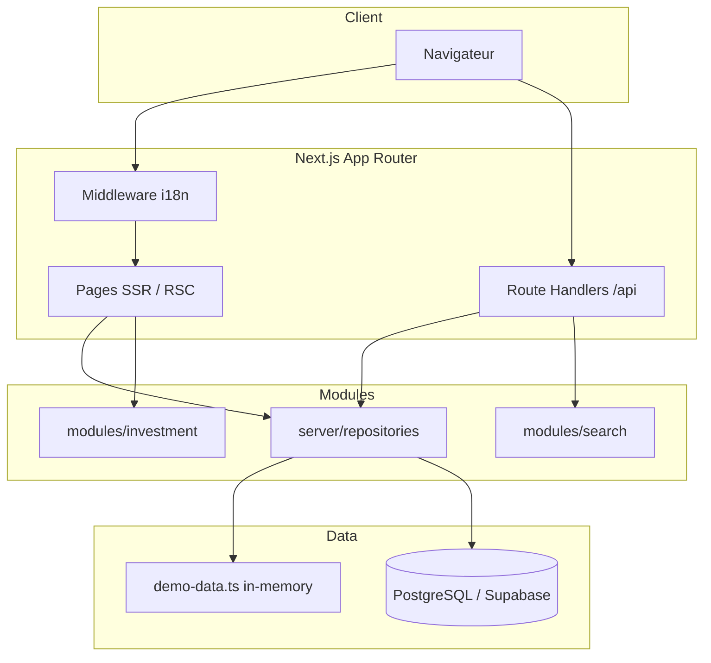

# Samsar IA — Architecture technique

## Stack

| Couche | Technologie | Version |
|--------|-------------|---------|
| Framework | Next.js (App Router) | 16.x |
| UI | React, Tailwind CSS 4 | 19.x |
| Langage | TypeScript | 5.x |
| ORM | Drizzle ORM | 0.45.x |
| Base de données | PostgreSQL + PostGIS | 16 |
| Auth | JWT (jose) + bcryptjs | MVP local |
| i18n | next-intl patterns + cookies | FR/EN/AR |
| Cartes | MapLibre GL | 6.x |
| Tests | Vitest | 4.x |
| Hébergement cible | Vercel + Supabase | — |

## Diagramme haut niveau



## Structure des modules

```
src/
├── app/                          # App Router
│   ├── [locale]/                 # Routes internationalisées
│   │   ├── page.tsx              # Accueil
│   │   ├── biens/                # Catalogue + fiches
│   │   ├── api/                  # Route handlers locale-scoped
│   │   ├── admin/                # Back-office
│   │   └── dashboard/            # Espace connecté
│   ├── sitemap.ts                # Sitemap global
│   └── robots.ts
├── components/                   # UI réutilisable
│   ├── ai/                       # Recherche conversationnelle
│   ├── investment/               # Simulateur
│   ├── listings/                 # Cartes, filtres
│   └── layout/                   # Header, footer, switchers
├── lib/
│   ├── auth/session.ts           # JWT, cookies
│   ├── db/                       # Drizzle schema + client
│   ├── data/demo-data.ts         # Données démo in-memory
│   ├── i18n/config.ts            # Locales, messages
│   └── seo/metadata.ts           # Metadata, JSON-LD
├── modules/                      # Logique métier pure
│   ├── investment/calculations.ts
│   └── search/natural-language-parser.ts
└── server/repositories/          # Accès données (abstraction)
    └── listings.ts
```

## Mode démo vs PostgreSQL

Le dépôt de données bascule selon la configuration :

```typescript
// src/lib/db/index.ts
export function isDatabaseConfigured(): boolean {
  return Boolean(process.env.DATABASE_URL);
}

export function getDb() {
  if (!process.env.DATABASE_URL) return null;
  // ... connexion Drizzle
}
```

| Aspect | `DEMO_MODE=true` (défaut) | PostgreSQL configuré |
|--------|----------------------------|------------------------|
| Source annonces | `DEMO_LISTINGS` in-memory | Table `listings` |
| Auth | `DEMO_USERS` hardcodés | Table `users` (futur) |
| Seed | Ignoré sans `DATABASE_URL` | `pnpm db:seed` |
| Persistance | Session uniquement (drafts en RAM) | Durable |
| Flag | `DEMO_MODE`, `is_demo` sur entités | `is_demo` conservé en transition |

### Bascule recommandée

1. **Dev local rapide** : aucune DB, `pnpm dev`
2. **Dev avec DB** : `docker compose up -d` → `DATABASE_URL` → `pnpm db:push` → `pnpm db:seed`
3. **Production** : Supabase PostgreSQL + `DEMO_MODE=false`

## App Router — conventions

- **SSR par défaut** : pages catalogue, fiches, accueil en Server Components
- **Client Components** : formulaires, carte, recherche IA, simulateur (`"use client"`)
- **Metadata** : `generateMetadata()` + helper `buildMetadata()`
- **API Routes** : sous `[locale]/api/` pour cohérence i18n (middleware exclut `/api` de la redirection locale)

## Middleware

`src/middleware.ts` :
- Redirige `/` → `/fr/` (ou cookie locale)
- Locales supportées : `fr`, `en`, `ar`
- Exclut `_next`, fichiers statiques, `/api`

## Couche repository

`src/server/repositories/listings.ts` centralise :
- `searchListings`, `getListingBySlug`, `getFeaturedListings`
- `getPendingListings`, `approveListing`, `rejectListing`
- `convertPrice` (taux de change)

> **Évolution** : brancher `getDb()` quand `DATABASE_URL` est défini, conserver fallback démo.

## Drizzle

- Schéma source : `src/lib/db/schema.ts`
- Migrations : `supabase/migrations/`
- Config : `drizzle.config.ts`
- Scripts : `db:generate`, `db:migrate`, `db:push`, `db:seed`

## Feature flags (env)

| Variable | Défaut | Effet |
|----------|--------|-------|
| `DEMO_MODE` | `true` | Bannière démo, footer disclaimer |
| `ENABLE_DESIGN_SYSTEM` | `true` | Page `/design-system` |
| `AI_PROVIDER` | `mock` | Comportement assistant IA |

## Dépendances externes

- **Images démo** : Unsplash (URLs publiques)
- **Tuiles carte** : MapLibre demo tiles (`NEXT_PUBLIC_MAP_STYLE`)
- **Fonts** : Google Fonts via `next/font`

## Évolutions architecturales prévues

1. Repository pattern complet avec injection DB/démo
2. Supabase Auth remplaçant JWT local
3. RLS PostgreSQL par rôle
4. Module `modules/ai/` avec `LLMProvider` (voir [`AI_ARCHITECTURE.md`](./AI_ARCHITECTURE.md))
5. PostGIS pour requêtes géospatiales
6. pgvector pour recherche sémantique (Phase 3)

## Références

- Schéma DB : [`DATABASE_MODEL.md`](./DATABASE_MODEL.md)
- Déploiement : [`DEPLOYMENT.md`](./DEPLOYMENT.md)
- Sécurité : [`SECURITY.md`](./SECURITY.md)
