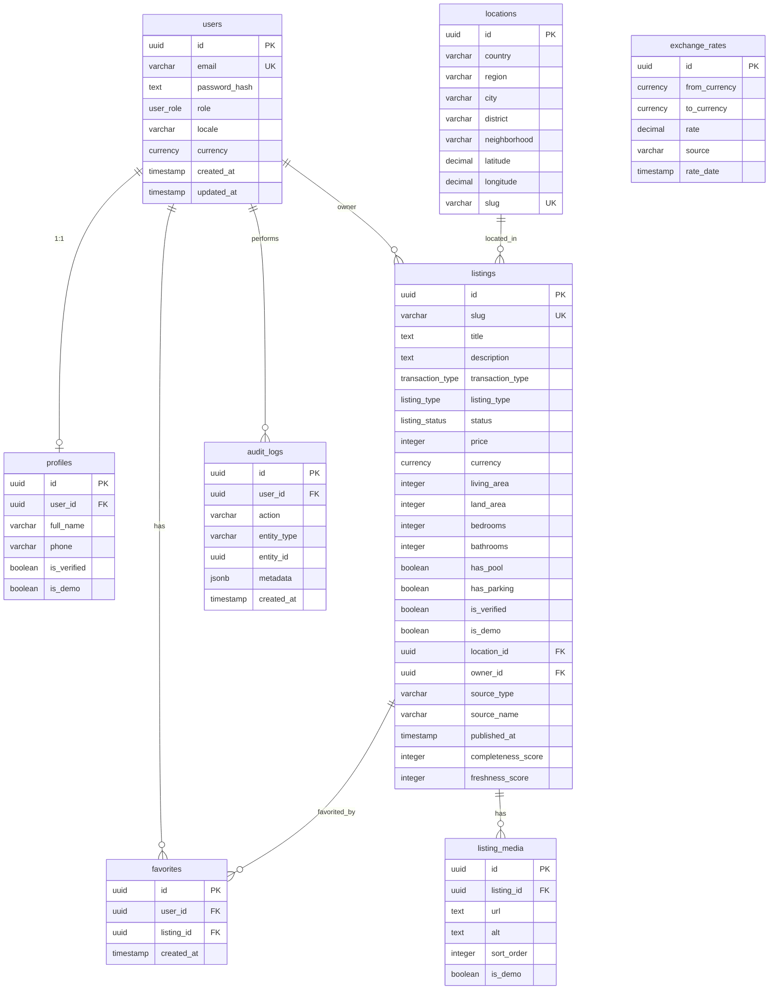

# Samsar IA — Modèle de données

> Schéma source de vérité : [`src/lib/db/schema.ts`](../src/lib/db/schema.ts)  
> Migration SQL initiale : [`supabase/migrations/0000_init.sql`](../supabase/migrations/0000_init.sql)

## Diagramme entité-relation



## Énumérations

### `user_role`

| Valeur | Description |
|--------|-------------|
| `visitor` | Non authentifié (implicite) |
| `buyer` | Acheteur particulier |
| `investor` | Investisseur |
| `agent` | Agent commercial |
| `agency_admin` | Responsable agence |
| `developer` | Promoteur |
| `admin` | Administrateur plateforme |

### `listing_type`

`apartment`, `villa`, `riad`, `land`, `commercial`, `office`

### `transaction_type`

`sale`, `long_term_rent`, `seasonal_rent`

### `listing_status`

| Statut | Description |
|--------|-------------|
| `draft` | Brouillon non soumis |
| `pending_review` | En attente modération |
| `published` | Visible publiquement |
| `archived` | Retiré du catalogue |
| `rejected` | Refusé par admin |

### `currency`

`MAD`, `EUR`, `USD`

## Entités détaillées

### `users`

Comptes authentifiés. Mot de passe hashé (`password_hash`). Préférences locale et devise.

**Index :** `email` unique.

### `profiles`

Extension 1:1 du user : nom, téléphone, badges vérification. `is_demo` pour comptes de démonstration.

### `locations`

Référentiel géographique hiérarchique : pays → région → ville → quartier. Slug unique pour URLs programmatiques futures (`marrakech/gueliz`).

**Index :** `locations_city_idx` sur `city`.

### `listings`

Entité centrale. Champs principaux :

- **Commercial** : `price`, `currency`, `transactionType`, `listingType`
- **Physique** : surfaces, chambres, équipements (pool, parking, jardin…)
- **Provenance** : `sourceType`, `sourceName`, `sourceUrl`, `externalId`, `firstSeenAt`, `lastSeenAt`
- **Qualité** : `completenessScore`, `freshnessScore`, `isVerified`
- **Géo** : `locationId` + coordonnées dénormalisées `latitude`/`longitude`
- **Cycle de vie** : `status`, `publishedAt`, `ownerId`

**Index :** `listings_status_idx`, `listings_city_price_idx`, `listings_transaction_idx`.

### `listing_media`

Galerie photos par annonce. Ordre via `sortOrder`. Cascade delete avec listing.

### `favorites`

Association user ↔ listing. Index sur `userId`.

### `exchange_rates`

Historique taux de change pour conversion affichage. Source documentée (`source`, `rateDate`).

### `audit_logs`

Journal actions admin et sensibles. Métadonnées JSON flexibles.

## Relations clés

```
users (1) ──→ (0..1) profiles
users (1) ──→ (0..n) listings [owner_id]
users (1) ──→ (0..n) favorites
locations (1) ──→ (0..n) listings [location_id]
listings (1) ──→ (0..n) listing_media
listings (1) ──→ (0..n) favorites
```

## Extensions PostgreSQL

```sql
CREATE EXTENSION IF NOT EXISTS "pgcrypto";
CREATE EXTENSION IF NOT EXISTS "postgis";
-- pgvector prévu Phase 3
```

## Correspondance démo ↔ schéma

| Démo (`demo-data.ts`) | Table |
|----------------------|-------|
| `DemoListing.location` | `locations` + FK `listings.location_id` |
| `DemoListing.images[]` | `listing_media` (1 row / image) |
| `DEMO_USERS` | `users` + `profiles` |
| `EXCHANGE_RATES` | `exchange_rates` |

## Seed

Le script `scripts/seed.ts` peuple PostgreSQL depuis `demo-data.ts` avec `onConflictDoNothing()` et `isDemo: true` sur toutes les entités.

## Évolutions prévues (hors MVP)

- Table `agencies` (1:n agents)
- Table `programs` (promoteur → lots neufs)
- Table `leads` (demandes de contact)
- Table `saved_searches` (alertes)
- Embeddings vectoriels sur `listings.description`
