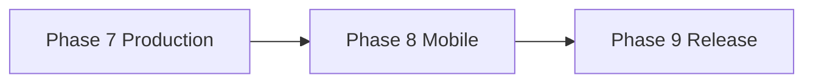

# DarBladi — Roadmap produit

> État actuel : **Phase 8 complétée** (v1.0.0).

---

## Phases 0–7 (✅ Terminées)

MVP → Investissement → IA + RAG → PostgreSQL → Multi-acteurs → Monétisation → Production (v0.9.0).

---

## Phase 7 — Production & croissance (✅ Terminée — v0.9.0)

Stripe webhooks, upload média, embeddings mock, 15 quartiers, affiliation.

---

## Phase 8 — Mobile & scale (✅ Terminée — v1.0.0)

| Livrable | Statut |
|----------|--------|
| Stripe Checkout production (REST + webhook HMAC) | ✅ |
| OpenAI embeddings provider + pgvector repository | ✅ |
| 23 quartiers / 22 villes | ✅ |
| Cron facturation MRR `/api/v1/cron/billing` | ✅ |
| App React Native / Expo (`mobile/`) | ✅ |

**Critère de sortie :** Checkout Stripe réel, recherche embeddings OpenAI-ready, couverture 20+ villes, app mobile consommant l'API partenaires.

---

## Phase 9 — Vision (📋 À venir)

| Livrable | Priorité |
|----------|----------|
| Auth mobile + favoris sync | P1 |
| Stripe Subscriptions récurrentes (Billing Portal) | P0 |
| Index pgvector alimenté en production | P1 |
| Notifications push alertes | P2 |
| App Store / Play Store release | P2 |

---

## Matrice de dépendances

## Principes transverses

- Conformité d'abord · Provenance explicite · SEO · Tests · Documentation à jour
