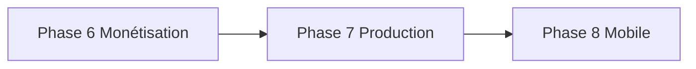

# DarBladi — Roadmap produit

> État actuel : **Phase 7 complétée** (v0.9.0).

---

## Phases 0–6 (✅ Terminées)

MVP → Investissement → IA + RAG → PostgreSQL → Multi-acteurs → Monétisation (v0.8.0).

---

## Phase 7 — Production & croissance (✅ Terminée — v0.9.0)

| Livrable | Statut |
|----------|--------|
| Stripe webhooks `/api/v1/webhooks/stripe` | ✅ |
| Upload média (mock + Supabase Storage) | ✅ |
| Embeddings pgvector mock + RAG hybride | ✅ |
| Expansion 14 villes / quartiers | ✅ |
| Programme affiliation agents | ✅ |
| Migration SQL pgvector | ✅ |
| Application mobile React Native | 📋 Phase 8 |

**Critère de sortie :** Upload photo annonce, recherche sémantique, parrainage agent tracé.

---

## Phase 8 — Mobile & scale (📋 Vision)

| Livrable | Priorité |
|----------|----------|
| App React Native / Expo | P1 |
| Stripe Checkout production | P0 |
| OpenAI embeddings + pgvector réel | P1 |
| 20+ villes couverture | P1 |
| Facturation MRR automatisée | P2 |

---

## Matrice de dépendances

## Principes transverses

- Conformité d'abord · Provenance explicite · SEO · Tests · Documentation à jour
