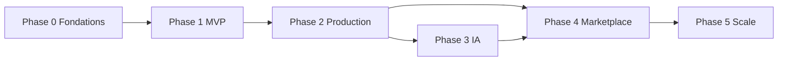

# DarBladi — Roadmap produit

> Phases alignées sur la vision marketplace immobilière intelligente au Maroc.  
> État actuel : **Phase 1 complétée** (MVP v0.1.0).

---

## Phase 0 — Fondations (✅ Terminée)

**Objectif :** Poser l'architecture, le schéma de données et l'environnement de développement.

| Livrable | Statut |
|----------|--------|
| Next.js 16 App Router + TypeScript | ✅ |
| Schéma Drizzle PostgreSQL + PostGIS | ✅ |
| Docker Compose PostgreSQL local | ✅ |
| Structure modules (`search`, `investment`) | ✅ |
| i18n FR/EN/AR + middleware locale | ✅ |
| Design system de base (Tailwind 4) | ✅ |
| Audit concurrentiel Holding IMMO | ✅ |
| Documentation technique initiale | ✅ |

**Critère de sortie :** `pnpm dev` fonctionne, schéma migrable, pages squelettes navigables.

---

## Phase 1 — MVP public (✅ Terminée — v0.1.0)

**Objectif :** Plateforme démontrable avec parcours complets en mode démo.

| Livrable | Statut |
|----------|--------|
| Catalogue ~15 biens fictifs multi-villes | ✅ |
| Recherche + filtres + fiches SEO | ✅ |
| Comparateur (3 biens) | ✅ |
| Simulateur rentabilité + scénarios | ✅ |
| Recherche IA (parseur mock) | ✅ |
| Carte MapLibre | ✅ |
| Auth JWT + comptes démo | ✅ |
| Publication annonce → modération admin | ✅ |
| Sitemap + robots.txt + JSON-LD | ✅ |
| Pages légales (mentions, confidentialité, CGU) | ✅ |
| Tests Vitest (investissement, parseur) | ✅ |

**Critère de sortie :** Démo end-to-end investisseur + agent + admin sans PostgreSQL obligatoire.

---

## Phase 2 — Investissement (✅ Terminée — v0.2.0)

**Objectif :** Outils d'aide à la décision pour investisseurs avec transparence et traçabilité.

| Livrable | Statut |
|----------|--------|
| Score investissement /100 (10 dimensions) | ✅ |
| Historique de prix sur fiches biens | ✅ |
| Estimation par comparables | ✅ |
| Rapport investissement imprimable | ✅ |
| Comparateur enrichi (score + cash-flow) | ✅ |
| Simulations sauvegardées | ✅ |
| Métriques sectorielles démo | ✅ |
| Schéma DB investissement | ✅ |
| Tests score, valuation, rapport | ✅ |

**Critère de sortie :** Investisseur peut scorer, comparer, estimer, simuler et générer un rapport depuis une fiche bien.

---

## Phase 3 — Production data & auth (🔜 Prochaine)

**Objectif :** Passer du mode démo à une base PostgreSQL durable avec authentification robuste.

| Livrable | Priorité |
|----------|----------|
| Repository branché PostgreSQL (fallback démo) | P0 |
| Supabase Auth (remplace JWT maison) | P0 |
| RLS policies par rôle | P0 |
| Upload média (Supabase Storage) | P1 |
| Favoris persistants | P1 |
| Email transactionnel (confirmation, reset MDP) | P1 |
| `DEMO_MODE=false` en production | P0 |
| CI/CD GitHub Actions | P1 |
| Monitoring erreurs (Sentry) | P2 |

**Critère de sortie :** Annonces et comptes persistés, admin modère en prod, pas de données RAM.

**Durée estimée :** 4–6 semaines.

---

## Phase 3 — Intelligence artificielle (📋 Planifiée)

**Objectif :** Assistant conversationnel production avec LLM et recherche sémantique.

| Livrable | Priorité |
|----------|----------|
| Module `LLMProvider` (OpenAI + mock) | P0 |
| Outils contrôlés (whitelist) | P0 |
| pgvector + embeddings descriptions | P1 |
| RAG pages quartiers | P1 |
| Rate limiting IA robuste | P0 |
| Résumés fiches auto (revue humaine) | P2 |
| Support multilingue NLU (AR) | P2 |

**Critère de sortie :** Requêtes NL complexes → résultats pertinents avec citations sources.

**Durée estimée :** 6–8 semaines.

---

## Phase 4 — Marketplace multi-acteurs (📋 Planifiée)

**Objectif :** Onboarding agences, promoteurs et flux partenaires conformes.

| Livrable | Priorité |
|----------|----------|
| Espace agence (multi-agents) | P0 |
| Dashboard promoteur + programmes neufs | P1 |
| Import API partenaires (contrats) | P1 |
| Pages programmatiques ville/quartier | P0 |
| Système leads + notifications | P1 |
| Badge vérification (`isVerified`) workflow | P1 |
| Facturation / abonnements agences | P2 |

**Critère de sortie :** ≥ 3 agences pilotes publient via la plateforme avec provenance tracée.

**Durée estimée :** 8–12 semaines.

---

## Phase 5 — Scale & monétisation (📋 Vision)

**Objectif :** Croissance, revenus et expansion géographique.

| Livrable | Priorité |
|----------|----------|
| Application mobile (React Native / PWA) | P2 |
| Alertes recherche sauvegardée | P1 |
| Analytics investisseur avancés | P1 |
| Expansion villes (Agadir, Fès, Essaouira…) | P1 |
| Paiement en ligne (acomptes réservation) | P2 |
| Programme affiliation agents | P2 |
| API publique partenaires | P2 |
| Conformité CNDP formalisée + DPO | P1 |

**Critère de sortie :** MRR agences, rétention utilisateurs, couverture nationale ≥ 10 villes.

**Horizon :** 6–12 mois post Phase 4.

---

## Matrice de dépendances

## Principes transverses

- **Conformité d'abord** : aucune source interdite (voir [`DATA_SOURCES_AND_COMPLIANCE.md`](./DATA_SOURCES_AND_COMPLIANCE.md))
- **Provenance explicite** : `sourceName`, `isDemo`, audit trail
- **SEO dès le départ** : sitemap fonctionnel, SSR
- **Tests sur logique métier** : calculs investissement, parseur recherche
- **Documentation à jour** : changelog à chaque release

## Jalons 2026

| Date | Jalon |
|------|-------|
| Q3 2026 | MVP v0.1.0 (Phase 1) |
| Q4 2026 | Production Supabase (Phase 2) |
| Q1 2027 | LLM production (Phase 3) |
| Q2 2027 | Pilotes agences (Phase 4) |
| Q4 2027 | Monétisation (Phase 5) |
