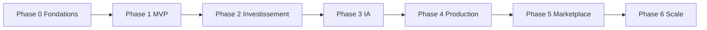

# DarBladi — Roadmap produit

> Phases alignées sur la vision marketplace immobilière intelligente au Maroc.  
> État actuel : **Phase 6 démarrée** (v0.6.0).

---

## Phase 0 — Fondations (✅ Terminée)

**Objectif :** Poser l'architecture, le schéma de données et l'environnement de développement.

| Livrable | Statut |
|----------|--------|
| Next.js 16 App Router + TypeScript | ✅ |
| Schéma Drizzle PostgreSQL + PostGIS | ✅ |
| Docker Compose PostgreSQL local | ✅ |
| Structure modules (`search`, `investment`) | ✅ |
| i18n FR/EN/AR + middleware locale | ✅ |
| Design system de base (Tailwind 4) | ✅ |
| Audit concurrentiel Holding IMMO | ✅ |
| Documentation technique initiale | ✅ |

---

## Phase 1 — MVP public (✅ Terminée — v0.1.0)

**Objectif :** Plateforme démontrable avec parcours complets en mode démo.

| Livrable | Statut |
|----------|--------|
| Catalogue ~15 biens fictifs multi-villes | ✅ |
| Recherche + filtres + fiches SEO | ✅ |
| Comparateur (3 biens) | ✅ |
| Simulateur rentabilité + scénarios | ✅ |
| Recherche IA (parseur mock) | ✅ |
| Carte MapLibre | ✅ |
| Auth JWT + comptes démo | ✅ |
| Publication annonce → modération admin | ✅ |
| Sitemap + robots.txt + JSON-LD | ✅ |
| Pages légales | ✅ |
| Tests Vitest | ✅ |

---

## Phase 2 — Investissement (✅ Terminée — v0.2.0)

**Objectif :** Outils d'aide à la décision pour investisseurs.

| Livrable | Statut |
|----------|--------|
| Score investissement /100 | ✅ |
| Historique de prix | ✅ |
| Estimation par comparables | ✅ |
| Rapport investissement imprimable | ✅ |
| Comparateur enrichi | ✅ |
| Simulations sauvegardées | ✅ |
| Schéma DB investissement | ✅ |

---

## Phase 3 — Intelligence artificielle (✅ Terminée — v0.3.0)

**Objectif :** Assistant conversationnel DarBladi production-ready.

| Livrable | Statut |
|----------|--------|
| Rebranding Samsar IA → DarBladi | ✅ |
| Module `LLMProvider` (Mock + OpenAI) | ✅ |
| Outils contrôlés (whitelist) | ✅ |
| API chat `/api/darbladi/chat` | ✅ |
| UI assistant multi-tours | ✅ |
| Rate limiting IA | ✅ |
| pgvector / RAG quartiers | ✅ Phase 3.1 |

---

## Phase 4 — Production data & auth (✅ Terminée — v0.4.0)

**Objectif :** Passer du mode démo à PostgreSQL durable avec auth robuste.

| Livrable | Statut |
|----------|--------|
| Repository PostgreSQL (fallback démo) | ✅ |
| Abstraction auth JWT + stub Supabase | ✅ |
| RLS policies par rôle | ✅ |
| Favoris persistants (API + DB) | ✅ |
| Simulations/rapports persistants en DB | ✅ |
| Seed enrichi (users, orgs, leads) | ✅ |
| CI/CD GitHub Actions | ✅ |
| `DEMO_MODE=false` en production | ✅ |
| Upload média Supabase Storage | 📋 P1 |
| Email transactionnel | 📋 P1 |

**Critère de sortie :** Annonces et comptes persistés avec fallback démo transparent.

---

## Phase 5 — Marketplace multi-acteurs (✅ Terminée — v0.5.0)

**Objectif :** Onboarding agences, promoteurs et flux partenaires.

| Livrable | Statut |
|----------|--------|
| Pages `/professionnels` et `/promoteurs` | ✅ |
| Dashboard leads CRM | ✅ |
| Import CSV partenaires | ✅ |
| Alertes / recherches sauvegardées | ✅ |
| Données démo orgs/agents/promoteurs | ✅ |
| Espace agence multi-agents (schéma) | ✅ |
| Pages programmatiques ville/quartier | ✅ (existant) |
| Facturation / abonnements agences | 📋 P2 |

**Critère de sortie :** Parcours agence + promoteur + leads démontrable end-to-end.

---

## Phase 3.1 — RAG quartiers (✅ Terminée — v0.6.0)

| Livrable | Statut |
|----------|--------|
| Base connaissance quartiers | ✅ |
| Recherche RAG mock (keyword scoring) | ✅ |
| Outil IA `getNeighborhoodContext` | ✅ |
| Pages SEO `/villes/[ville]/[quartier]` | ✅ |
| Citations RAG dans assistant | ✅ |

---

## Phase 6 — Scale & monétisation (🔜 En cours)

| Livrable | Statut |
|----------|--------|
| Analytics investisseur `/dashboard/analytics` | ✅ |
| Espace agence multi-agents `/dashboard/agence` | ✅ |
| Expansion pages quartiers SEO | ✅ |
| Application mobile / PWA | 📋 P2 |
| Paiement en ligne | 📋 P2 |
| API publique partenaires | 📋 P2 |
| Conformité CNDP formalisée | 📋 P1 |

---

## Matrice de dépendances

## Principes transverses

- **Conformité d'abord** : aucune source interdite
- **Provenance explicite** : `sourceName`, `isDemo`, audit trail
- **SEO dès le départ** : sitemap, SSR
- **Tests sur logique métier**
- **Documentation à jour**
