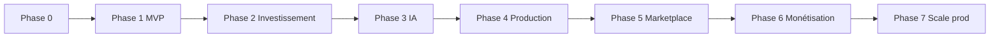

# DarBladi — Roadmap produit

> Phases alignées sur la vision marketplace immobilière intelligente au Maroc.  
> État actuel : **Phase 6 complétée** (v0.8.0).

---

## Phase 0 — Fondations (✅ Terminée)

| Livrable | Statut |
|----------|--------|
| Next.js 16 App Router + TypeScript | ✅ |
| Schéma Drizzle PostgreSQL + PostGIS | ✅ |
| Docker Compose PostgreSQL local | ✅ |
| i18n FR/EN/AR + middleware locale | ✅ |
| Design system de base (Tailwind 4) | ✅ |

---

## Phase 1 — MVP public (✅ Terminée — v0.1.0)

Catalogue, recherche, auth JWT, admin, i18n, tests.

---

## Phase 2 — Investissement (✅ Terminée — v0.2.0)

Score, historique prix, estimation, rapports, simulations.

---

## Phase 3 — Intelligence artificielle (✅ Terminée — v0.3.0)

Assistant DarBladi, LLM mock/OpenAI, outils contrôlés, rate limiting.

---

## Phase 3.1 — RAG quartiers (✅ Terminée — v0.6.0)

Base connaissance, RAG mock, pages SEO quartiers, citations IA.

---

## Phase 4 — Production data & auth (✅ Terminée — v0.4.0)

PostgreSQL, auth abstraction, favoris DB, CI, RLS, seed enrichi.

---

## Phase 5 — Marketplace multi-acteurs (✅ Terminée — v0.5.0)

Professionnels, promoteurs, CRM leads, import CSV, alertes.

---

## Phase 6 — Scale & monétisation (✅ Terminée — v0.8.0)

| Livrable | Statut |
|----------|--------|
| Analytics investisseur | ✅ |
| Espace agence multi-agents | ✅ |
| API publique partenaires v1 | ✅ |
| Conformité CNDP + cookie consent | ✅ |
| PWA manifest + offline (service worker) | ✅ |
| Email transactionnel (mock + Resend) | ✅ |
| Paiement en ligne (acompte + abonnements) | ✅ |
| Facturation agences `/dashboard/facturation` | ✅ |
| Upload média Supabase Storage | 📋 Phase 7 |

**Critère de sortie :** Parcours monétisation démo end-to-end (acompte bien + abonnement pro).

---

## Phase 7 — Production & croissance (📋 Vision)

| Livrable | Priorité |
|----------|----------|
| Stripe production + webhooks | P0 |
| Upload média Supabase Storage | P1 |
| pgvector embeddings réels | P1 |
| Application mobile React Native | P2 |
| Expansion 10+ villes | P1 |
| Programme affiliation agents | P2 |

---

## Matrice de dépendances

## Principes transverses

- **Conformité d'abord** : aucune source interdite
- **Provenance explicite** : `sourceName`, `isDemo`, audit trail
- **SEO dès le départ** : sitemap, SSR
- **Tests sur logique métier**
- **Documentation à jour**
