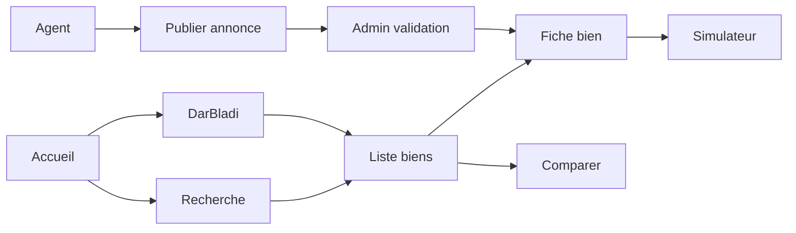
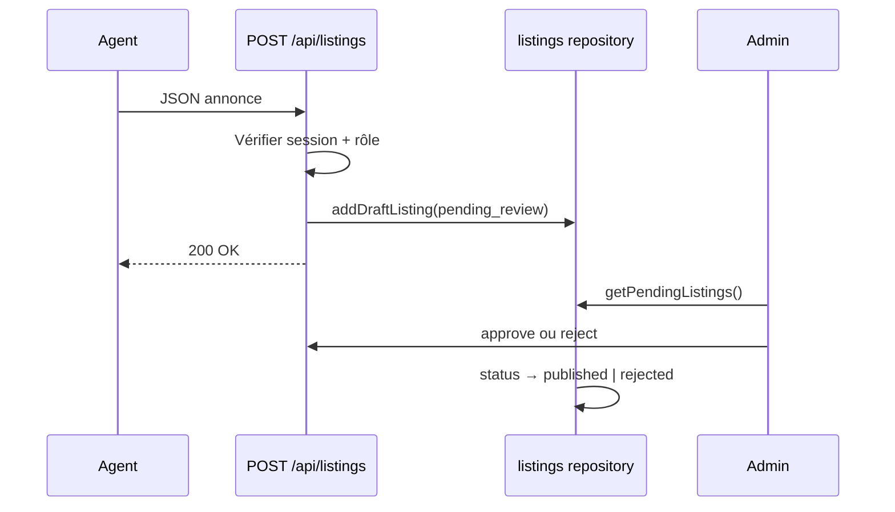

# DarBladi — Parcours utilisateur clés

## Vue d'ensemble



---

## 1. Recherche classique

**Acteur :** Visiteur, acheteur, investisseur  
**Point d'entrée :** `/[locale]/`, `/acheter`, `/louer`, `/biens`

### Étapes

1. Saisie critères dans la barre de recherche (ville, type, budget)
2. Application des filtres latéraux (`ListingFilters`) : type, quartier, prix, surface, chambres, équipements
3. Tri : récents, prix ↑↓, surface ↓
4. Affichage grille de `ListingCard` (pagination 12/page)
5. Clic → fiche bien `/biens/[slug]`

### Données

- Repository : `searchListings()` dans `src/server/repositories/listings.ts`
- Source MVP : `DEMO_LISTINGS` (in-memory) ou PostgreSQL si configuré

### Règles métier

- Seuls les biens `status: published` sont visibles (sauf contexte admin)
- Filtres combinables (ET logique)
- Conversion devise via cookie `currency` + taux `EXCHANGE_RATES`

---

## 2. Comparaison de biens

**Acteur :** Investisseur, acheteur  
**Point d'entrée :** `/[locale]/comparer?ids=...`

### Étapes

1. Sélection de 2 à 3 biens (depuis liste ou fiche)
2. Affichage tableau comparatif : prix, surface, chambres, rendement estimé, équipements
3. Lien vers simulateur pré-rempli (optionnel)

### Règles

- Maximum 3 biens simultanés
- Slugs ou IDs en query string

---

## 3. Publication d'annonce

**Acteur :** Agent, agency_admin, admin  
**Point d'entrée :** `/[locale]/dashboard/annonces/nouveau`

### Étapes

1. Connexion requise (`agent`, `agency_admin` ou `admin`)
2. Formulaire : titre, description, type, transaction, prix, ville, quartier, surface, chambres
3. Soumission POST `/[locale]/api/listings`
4. Création avec `status: pending_review`, `isDemo: true`, référence `SA-*`
5. Redirection dashboard avec message de confirmation

### Diagramme de séquence



### Champs obligatoires MVP

- title, description, listingType, transactionType, price, city, neighborhood

---

## 4. Validation admin

**Acteur :** Admin  
**Point d'entrée :** `/[locale]/admin`

### Étapes

1. Connexion compte `admin@darbladi.demo`
2. Liste annonces `draft` ou `pending_review`
3. Action **Approuver** → POST `/api/admin/listings/[id]/approve` → `published` + `publishedAt`
4. Action **Rejeter** → POST `/api/admin/listings/[id]/reject` → `rejected`

### Contrôles

- Redirection `/connexion` si rôle ≠ admin
- Route exclue du sitemap et `robots.txt`

---

## 5. Recherche IA (DarBladi)

**Acteur :** Utilisateur assistant (tous)  
**Point d'entrée :** `/[locale]/darbladi`

### Étapes

1. Saisie requête en langage naturel (ex. *« Villa avec piscine à Amelkis moins de 15 M MAD »*)
2. POST `/[locale]/api/search/conversational` avec `{ query }`
3. Parseur extrait filtres structurés (`SearchFilters`)
4. Affichage : filtres détectés, **hypothèses** (ex. vente par défaut), **champs manquants**
5. Bouton « Appliquer les filtres » → redirection `/biens?city=...&hasPool=true`

### Modes

| Mode | Condition | Comportement |
|------|-----------|--------------|
| `mock` | Pas de `OPENAI_API_KEY` | Parseur regex local (`natural-language-parser.ts`) |
| `ai_available` | Clé présente | Même parseur + note branchement LLM futur |

### Exemple de sortie

```json
{
  "filters": {
    "transactionType": "sale",
    "city": "Marrakech",
    "neighborhood": "Amelkis",
    "listingType": "villa",
    "hasPool": true,
    "maxPrice": 15000000
  },
  "assumptions": ["Type de transaction non précisé — recherche vente par défaut"],
  "missing": [],
  "mode": "mock"
}
```

---

## 6. Simulateur d'investissement

**Acteur :** Investisseur  
**Point d'entrée :** `/[locale]/simulateur-rentabilite`

### Étapes

1. Saisie prix, frais acquisition, crédit, loyers, charges
2. Calcul rendement brut/net, cash-flow, cap rate
3. Bascule scénarios prudent / central / optimiste
4. (Optionnel) Pré-remplissage depuis fiche bien

Voir [`INVESTMENT_CALCULATIONS.md`](./INVESTMENT_CALCULATIONS.md).

---

## 7. Authentification

**Acteur :** Tous utilisateurs enregistrés  
**Points d'entrée :** `/connexion`, `/inscription`

### Flux connexion

1. Email + mot de passe
2. Vérification contre `DEMO_USERS` (MVP)
3. JWT signé (jose) → cookie `darbladi_session` HttpOnly, 7 jours
4. Redirection dashboard ou page d'origine

### Flux inscription

1. Formulaire register → POST `/api/auth/register`
2. Création utilisateur rôle `buyer` par défaut

---

## 8. Favoris (connecté)

**Acteur :** Acheteur connecté  
**Point d'entrée :** `/[locale]/dashboard/favoris`

### Étapes MVP

1. Clic cœur sur `ListingCard` (client)
2. Stockage session/local (MVP simplifié)
3. Consultation liste favoris dashboard

> En production : persistance table `favorites` (userId + listingId).

---

## Pages et routes principales

| Route | SSR | Auth |
|-------|-----|------|
| `/[locale]/` | ✓ | — |
| `/[locale]/biens` | ✓ | — |
| `/[locale]/biens/[slug]` | ✓ | — |
| `/[locale]/comparer` | ✓ | — |
| `/[locale]/darbladi` | ✓ | — |
| `/[locale]/admin` | ✓ | admin |
| `/[locale]/dashboard/*` | ✓ | connecté |
